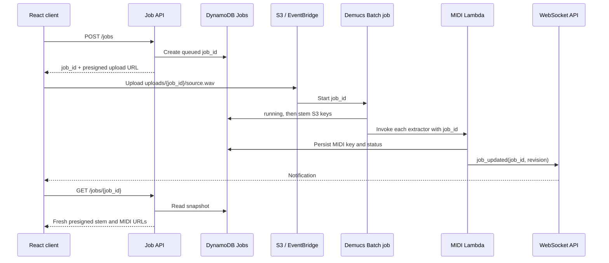

# Durable Job-ID Processing Plan

## Goal

Make a stem-splitting job recoverable when a browser WebSocket disconnects,
the page reloads, or an individual completion notification is missed.

DynamoDB becomes the source of truth. WebSockets remain useful for immediate
updates, but they are not relied on as durable storage or a delivery guarantee.

## Design Principles

- Generate one `job_id` before the client uploads the source audio.
- Store S3 object keys and processing state, not presigned URLs. Generate fresh
  URLs when the client requests a job snapshot.
- Persist a completed stem or MIDI result before publishing its WebSocket
  notification.
- Do not store a WebSocket connection ID in the source audio or stem metadata
  as the authoritative callback target. A connection ID is temporary.
- Authorize every job read or subscription against the authenticated owner.

## Storage Model

Use a DynamoDB `CloudDSPJobs` table. A single item is sufficient initially:

```json
{
  "job_id": "uuid",
  "user_id": "authenticated-user-id",
  "status": "midi_processing",
  "input_bucket": "clouddsp-input-...",
  "input_key": "uploads/uuid/source.wav",
  "stem_mode": "6-stems",
  "stems": {
    "drums": {
      "status": "ready",
      "s3_key": "stems/uuid/drums.wav"
    },
    "vocals": {
      "status": "ready",
      "s3_key": "stems/uuid/vocals.wav"
    }
  },
  "midi": {
    "drums": {
      "status": "ready",
      "extractor": "adtof",
      "s3_key": "midi/uuid/drums.mid",
      "bpm_key": "midi/uuid/drums_bpm.json"
    },
    "vocals": {
      "status": "processing"
    }
  },
  "revision": 12,
  "created_at": "ISO-8601 timestamp",
  "updated_at": "ISO-8601 timestamp",
  "expires_at": 0
}
```

`expires_at` is a DynamoDB TTL attribute used to clean up old jobs. Add a GSI
on `user_id` and `updated_at` if the UI will later show recent jobs.

Optionally add a `CloudDSPConnections` table keyed by `connection_id`, with
`user_id`, `last_seen_at`, and TTL. It is helpful for observability and cleanup
but should never be the only place a job result is stored.

## API and Event Flow



### 1. Create job and upload

The existing presigned-upload endpoint can create the job. It returns:

```json
{
  "job_id": "uuid",
  "upload_url": "size-constrained presigned POST URL",
  "input_key": "uploads/uuid/source.wav"
}
```

The client uploads to that exact key. It may retain `connection-id` metadata
temporarily for backward compatibility, but all new processors use `job_id`
from the key or object metadata.

### 2. Process artifacts

EventBridge and Batch receive `job_id`. Demucs writes stem keys using the job
prefix, for example `stems/{job_id}/drums.wav`, then updates the job item.

Basic Pitch and ADTOF receive `job_id`, write `midi/{job_id}/{stem}.mid`, and
update only their own nested MIDI status. Use conditional DynamoDB updates and
increment `revision` so late workers cannot overwrite newer data.

### 3. Notify and hydrate

After a successful database update, send a small notification:

```json
{
  "type": "job_updated",
  "job_id": "uuid",
  "revision": 12
}
```

The browser fetches `GET /jobs/{job_id}` and merges the complete snapshot.
The status endpoint generates fresh one-hour presigned URLs from stored S3
keys. This makes duplicate and out-of-order notifications harmless.

## WebSocket Lifecycle

1. On opening a socket, the client sends `subscribe` for each active job.
2. The WebSocket Lambda verifies that the authenticated user owns the job and
   associates the current connection with it.
3. It immediately sends a job snapshot or `job_updated` notification.
4. The client sends a lightweight heartbeat every 2–4 minutes. This keeps the
   socket active and detects a broken connection; it does not retrieve files.
5. On close, reconnect with exponential backoff. Once connected, subscribe to
   every active job again and request a fresh snapshot.

Heartbeat is not a correctness mechanism. The `GET /jobs/{job_id}` snapshot is
the recovery mechanism. While a job is pending, also poll this endpoint every
10–20 seconds with backoff as a fallback for dropped WebSocket notifications.

## IaC Changes

- Add `CloudDSPJobs` DynamoDB table with TTL and point-in-time recovery.
- Add the optional `CloudDSPConnections` table if connection auditing is needed.
- Grant only the required `GetItem`, `PutItem`, and `UpdateItem` permissions to
  the upload, Batch, Basic Pitch, and ADTOF roles.
- Add `POST /jobs` and authenticated `GET /jobs/{job_id}` API routes.
- Add WebSocket `subscribe` and `heartbeat` routes, replacing the current echo-
  only lifecycle behavior.
- Ensure API Gateway management permissions are scoped to the application
  WebSocket API ARN rather than a wildcard.

## Frontend Changes

- Persist active `job_id` values in component state and session storage.
- Replace connection-ID-dependent upload requests with job creation.
- On `job_updated`, fetch and merge the current snapshot.
- Track per-stem states separately: `queued`, `processing`, `ready`, `failed`.
- Show MIDI URL download/parse failures explicitly instead of continuing to
  display them as processing.
- Reconnect, resubscribe, and poll while work remains pending.

## Delivery Order

1. Add the DynamoDB table and job status API in IaC.
2. Update upload creation to generate `job_id` and create the database record.
3. Pass `job_id` through EventBridge, Batch, Demucs, Basic Pitch, and ADTOF.
4. Persist worker results before WebSocket notification.
5. Add frontend snapshot hydration and polling fallback.
6. Add reconnect, subscription, heartbeat, and connection cleanup.
7. Test normal completion, page reload, socket disconnect, duplicate events,
   failed MIDI extraction, and expired presigned URLs.

## Acceptance Criteria

- Reloading the page during Batch or MIDI processing restores every completed
  artifact without reprocessing audio.
- A missed WebSocket message does not leave a track permanently pending.
- A new connection receives current results for its subscribed jobs.
- Presigned URLs can be regenerated after expiry from the stored S3 keys.
- Every user can read and subscribe only to their own jobs.
