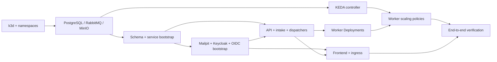

# CloudDSP local Kubernetes deployment orchestration plan

## Purpose and scope

Make the existing `k3d-clouddsp-local` deployment reproducible through a
versioned, non-interactive entry point. The entry point should install a fresh
local cluster in dependency order, reconcile an existing cluster without
discarding data, and report which stage failed. It will manage only the local
Kubernetes track under `k8Deployment/kubernetes/`; the AWS deployment remains
independent. Root `plan` and read-only `verify` are implemented. An
existing-cluster `reconcile` now covers the audited PostgreSQL and RabbitMQ
external-state stages; fresh-cluster bootstrap and full release reconciliation
remain planned.

Follow [the Kubernetes instructions](../AGENTS.md),
[the local implementation plan](../plan.md), and the existing
[cluster scripts](scripts/README.md) when implementing each stage. In
particular, keep secrets in ignored local configuration, pin reviewed images,
deploy through versioned Helm configuration and non-interactive scripts, and
install KEDA before applying any `ScaledObject`.

## Baseline observed on 2026-09-26

The local context is `k3d-clouddsp-local`. A read-only inventory showed:

- Namespaces `clouddsp-system`, `clouddsp-data`, `clouddsp-app`, and `keda`.
- Bound local-path PVCs for the PostgreSQL, MinIO, and RabbitMQ StatefulSets.
  All three StatefulSets were Ready at one replica. Preserve their object
  names, selectors, volume claim templates, and data during adoption.
- Ready Keycloak, Mailpit, frontend, Job API, upload-intake, and both dispatcher
  Deployments. Demucs, Basic Pitch, and ADTOF were at zero replicas by design;
  their KEDA `ScaledObject` resources reported Ready.
- Helm releases for KEDA and the k3s-managed Traefik components. No CloudDSP
  application or data-service Helm release was listed.

This is a point-in-time observation, not a substitute for the implementation
preflight. The existing [service manifests](services/) and
[KEDA Helm release](helm/keda/README.md) are the starting inputs. The proposed
orchestrator must inventory the cluster again immediately before adoption.
The first delivery task now has a [resource and ownership map](resource-ownership-map.md)
with the source/live inventory, proposed owners, prerequisites, and data
preservation rules.

The first stateless adoption trial completed later on **2026-09-26**:
[Mailpit](helm/mailpit/README.md) is now Helm release `clouddsp-mailpit` in
`clouddsp-data`. Its four resource UIDs, two Service IPs, Pod UID, and
browser route were preserved. The versioned SMTP capture smoke passed. This
does not change the baseline observation or authorize adoption of other
components without their own review.

The next stateless trial on the same date adopted
[frontend](helm/frontend/README.md) as release `clouddsp-frontend` in
`clouddsp-app`. Its three resource UIDs, Service IP, Pod UID, OIDC redirect
host, and browser route were preserved. The app shell, CSP header, and built
JavaScript/CSS assets passed the route smoke check. The remaining components
still require separate adoption checks.

The legacy [dispatcher](helm/dispatcher/README.md) was then adopted as release
`clouddsp-dispatcher` in `clouddsp-app`, with its Deployment UID, Pod UID, and
Demucs-only image digest unchanged. It is an internal publisher with no HTTP
route; Pod readiness and image identity do not replace the separate
outbox-to-RabbitMQ message-path smoke. The generic dispatcher remains outside
this release.

The route-aware [generic dispatcher](helm/generic-dispatcher/README.md) was
then adopted as the separate `clouddsp-generic-dispatcher` release. Its
Deployment UID, Pod UID, generic runtime command, and locked image digest
were preserved. Both dispatchers remain at one replica. The controlled Basic
Pitch routing smoke subsequently passed: its synthetic outbox event was
published to the intended queue, acknowledged, and cleaned up. Scaling down
the legacy controller remains a separate rollout decision.

The [Job API](helm/job-api/README.md) was then adopted as the separate
`clouddsp-job-api` release. Its three resource UIDs, Service IP, Pod UID, and
image digest were preserved. Both same-origin protected paths still return
HTTP 401 to unauthenticated callers. Its authenticated-read smoke subsequently
passed using a disposable Keycloak user and client: `/auth/me` returned the
user's subject, `/jobs` returned an empty owner-bound list, and both temporary
identities and the completed test Job were removed. Upload and job lifecycle
smokes remain separate checks.

The outbound [upload-intake](helm/upload-intake/README.md) Deployment was then
adopted as the `clouddsp-upload-intake` release. Its Deployment UID, Pod UID,
and locked image digest were preserved. Its separate source-to-outbox
integration test subsequently passed. Its test image was aligned with the
reviewed Job API digest, and the fixed test Pod received a narrow RabbitMQ
management-port NetworkPolicy exception after the first attempt exposed that
missing route. Both dispatcher Helm releases were paused during the pending
outbox assertion and restored to one replica afterward; their current Helm
revisions are 3. The disposable test Job and its synthetic resources were
cleaned up, and the source and Demucs queues were empty.

The [Keycloak](helm/keycloak/README.md) Deployment, Service, and Ingress were
then adopted as the separate `clouddsp-keycloak` identity release in
`clouddsp-data`. All three resource UIDs, the Pod UID, Service IP, public OIDC
issuer, and existing database/administrator Secret references were preserved.
The browser discovery route, internal discovery/issuer smoke, React PKCE
authorization login-form smoke, verification-email delivery to Mailpit, and
a real temporary-user token followed by protected Job API reads all passed.
PostgreSQL, runtime Secrets, and realm/client/SMTP bootstrap Jobs remain
outside this long-lived release.

The first protected data-service trial adopted
[PostgreSQL](helm/postgresql/README.md) as `clouddsp-postgresql` revision 1.
Immediately before takeover, a full logical backup of four databases and
fourteen login roles restored successfully in an isolated no-network Docker
instance; the owner-only backup remains under ignored `k8Deployment/.local/`.
The chart preserved the StatefulSet, both Services, running Pod, normal
Service IP, and bound PVC/PV identities. The ClusterIP read/write smoke
created, read, and dropped its disposable table, then its Job was removed.
Database contents, credentials, migrations, and bootstrap Jobs remain outside
the long-lived Helm release.

The next protected data-service trial adopted
[MinIO](helm/minio/README.md) as `clouddsp-minio` revision 1. A stopped-volume
archive restored into a disposable MinIO server with matching AMQP target
configuration; two buckets, 489 current objects, object versions,
notifications, and a downloaded object's bytes matched. The adoption kept
the StatefulSet, two Services, Ingress, post-backup Pod, Service IPs, and
bound PVC/PV identities. Both the in-cluster S3 create/read/delete smoke and
the restricted Job API access smoke passed. Bucket data, IAM, credentials,
and bootstrap Jobs remain outside the release.

The final protected data-service trial adopted
[RabbitMQ](helm/rabbitmq/README.md) as `clouddsp-rabbitmq` revision 1. A
stopped-volume archive restored into a no-network broker with the same node
name; two vhosts, 12 queues, full definitions, and queue depths matched.
Five resource UIDs, the post-backup Pod UID, all Service IPs, and the bound
PVC/PV identities remained stable. The in-cluster AMQP
publish/consume/acknowledge smoke passed and its disposable Job was removed.
The queues held no ready or unacknowledged messages at snapshot time, so the
restore rehearsal did not exercise saved-message replay.

The two shared KEDA authentication resources were then adopted as the
independent [scaling-auth release](helm/scaling-auth/README.md), revision 1.
Both TriggerAuthentication UIDs, spec generations, and finalizers stayed
stable; all three dependent ScaledObjects remained Ready, and their HPA and
worker Deployment UIDs were unchanged. Runtime Secret values were not read or
placed in Helm. Basic Pitch, ADTOF, and Demucs have since received separate
worker releases and processing smoke trials; see the validation record below
for each outcome.

## Deployment model

Use **independent Helm releases** for components with distinct upgrade and
failure boundaries. A small host-side script is the root composition layer:
it renders/checks inputs, installs or upgrades each release, waits for its
specific readiness condition, then moves to the next stage. This gives the
CloudFormation-style sectional layout without making PostgreSQL, workers,
and the frontend one indivisible release.

| Boundary | Proposed ownership | Namespace | Notes |
| --- | --- | --- | --- |
| k3d topology, registry, packaged Traefik | Existing `cluster.sh` and k3s configuration | Host / `kube-system` | Do not take ownership of packaged Traefik. Never recreate an existing cluster during reconcile. |
| Project namespaces | Versioned cluster manifest and script | Cluster | Keep existing namespace ownership outside application releases. |
| KEDA | Existing pinned `install-keda.sh` release | `keda` | Verify operator/webhook readiness and CRDs before scaling resources. |
| Shared scaler authentication | Independent `clouddsp-scaling-auth` release | `clouddsp-app` | Own only the two existing TriggerAuthentications; refer to existing app-namespace Secrets by name/key. |
| PostgreSQL, MinIO, RabbitMQ | One CloudDSP Helm release per data service | `clouddsp-data` | Stateful adoption occurs after stateless components and data-safety checks. |
| Keycloak, Mailpit | Separate releases | `clouddsp-data` | Keycloak depends on PostgreSQL and its database bootstrap. |
| Job API, upload-intake, dispatcher, generic dispatcher, frontend | Separate app releases | `clouddsp-app` | The two dispatcher Deployments have separate charts, releases, and image locks despite sharing one image repository. |
| Demucs, Basic Pitch, ADTOF | One worker release each | `clouddsp-app` | Adopt each existing Deployment and ScaledObject together after KEDA and scaler authentication; preserve the scaler's worker target. |
| Bootstrap jobs and database migrations | Versioned manifests invoked by narrowly scoped scripts | `clouddsp-data` / `clouddsp-app` | These are state transitions with durable results, not continuously reconciled workloads. |
| Runtime and temporary bootstrap Secrets | Ignored local files consumed by scripts | Relevant namespace | Charts reference existing Secret names; secret values never enter chart values or Helm release history. |

Do not make a single umbrella chart the only release: Helm chart dependencies
are rendered into one release and do not express the service readiness sequence
needed here. Shared chart helpers are fine where they reduce duplication. The
charts should render reviewed Kubernetes resources; the script owns ordering,
readiness checks, and one-time transitions.

## Proposed repository artifacts

Add these incrementally, after the resource inventory and release boundaries
are reviewed:

```text
kubernetes/
  helm/
    keda/                         # existing pinned upstream release
    postgresql/ minio/ rabbitmq/   # CloudDSP data-service charts
    keycloak/ mailpit/             # identity and local email charts
    job-api/ upload-intake/        # application charts
    dispatcher/ generic-dispatcher/ frontend/
    demucs/ basic-pitch/ adtof/    # worker charts
    values/local.yaml              # non-secret local profile, if useful
    values/gpu.yaml                # separate native Linux GPU profile
  scripts/
    deploy-local.sh                # proposed bootstrap/reconcile/verify entry point
    lib/deploy-*.sh                # narrow stage helpers, only if needed
  tests/deployment/               # render, ownership, ordering, and failure checks
```

Keep [images.lock.yaml](images.lock.yaml) as the source of reviewed image
digests. Chart values may contain image references and non-secret settings,
but must not duplicate credentials. Keep the GPU profile separate: a Mac k3d
run verifies integration and CPU operation, not CUDA behavior.

## Orchestration sequence

Each stage has a prerequisite, action, and observable completion gate. A
failed gate stops the run. Independent later stages are not applied after a
failure.

| Stage | Action | Completion gate |
| --- | --- | --- |
| 0. Preflight | Confirm Docker/k3d/kubectl/Helm, explicit context, cluster identity when present, chart locks, reviewed image digests/build inputs, and required ignored Secret files. Inventory existing Helm and Kubernetes ownership when a cluster exists. | Inputs are valid; no unexpected ownership or immutable-field change on an existing cluster. Print a redacted plan before mutation. |
| 1. Cluster foundation | For a fresh install only, call `cluster.sh create`. Create the dedicated registry on a clean machine or attach a healthy retained registry after normal cluster cleanup. Apply versioned namespaces. | Nodes Ready; project namespaces Active; local registry reachable. |
| 1a. Image availability | Verify every required pinned image digest in the local registry. When absent, fetch the published CloudDSP image from the public `y1ktor/clouddsp` Docker Hub repository, copy it to the local registry, and verify the resulting immutable digest before installation. Stop on missing or mismatched images; never rewrite the lock automatically. | Each required local image is available at its reviewed digest before its workload is installed. |
| 2. Data services | Reconcile PostgreSQL, RabbitMQ, and MinIO independently. | StatefulSets Ready; PVCs Bound; service-level health checks pass. A StatefulSet being Ready alone is insufficient to prove its bootstrap state. |
| 3. Data bootstrap | Create/verify databases and least-privilege roles; apply PostgreSQL migrations in numeric order; import RabbitMQ topology and identities; create/verify MinIO buckets, policies, and source notification. | Durable schema migration ledger and service-specific verification match the versioned inputs. Temporary bootstrap credentials are removed only after successful verification. |
| 4. Identity and local email | Reconcile Mailpit, then Keycloak after its database exists. Run versioned realm/client/audience/SMTP configuration steps. | Mailpit and Keycloak Ready; OIDC discovery, realm/client settings, and local SMTP routing verified. |
| 5. App services | Reconcile Job API, upload-intake, dispatcher, and generic dispatcher using existing runtime Secrets. | Each required Deployment Ready; `/readyz` or an equivalent dependency-aware probe succeeds where available. |
| 6. Workers and scaling | Install/verify KEDA if needed. Reconcile worker Deployments and required role/policy bootstrap. Apply TriggerAuthentications and then each worker `ScaledObject`. | KEDA CRDs/controllers Ready; all three `ScaledObject` resources Ready and bound to the intended Deployment. Zero worker replicas is valid when queues and due work are empty. |
| 7. Browser route | Reconcile frontend after public Keycloak/API/MinIO configuration is checked; verify ingress resources. | Frontend Ready; authenticated browser/API routing check passes. |
| 8. Verification | Run a small non-destructive smoke first, then the reviewed end-to-end suite. | Login, direct upload, processing to terminal state, MIDI/artifact access, polling recovery, and selected failure/idempotency checks pass. Record report and release revisions. |

The standalone [fresh-cluster foundation stage](scripts/deploy-local-foundation.rb)
now implements stage 1's cluster and namespace creation guard. It requires the
target k3d cluster to be absent, creates or reuses the dedicated registry,
creates the three versioned namespaces, and verifies nodes, registry,
and packaged system controllers. It is not yet the root `bootstrap` command;
image availability, releases, and external-state stages still need fresh-path
orchestration.

The standalone [image registry stage](scripts/image-registry-stage.rb) now
implements stage 1a's source-to-Docker-Hub publication and read-only digest
verification for all 18 Linux ARM64 local images. It can mirror missing
digest-pinned images from public `y1ktor/clouddsp` into the local registry.
Publication and anonymous remote verification passed for every current image;
the reverse path preserved the Job API digest in a disposable empty registry.
The root `prepare` command now composes the foundation and image stages only.
It checks the public locked digests before cluster creation, then mirrors and
verifies images after the registry exists. Its creation path still needs a
disposable-cluster trial; full application `bootstrap` remains later work.

Mailpit now has a separately guarded fresh `install` mode in its release
runner. It requires the release and all four chart objects to be absent and
uses ordinary Helm install followed by the existing ownership, readiness, and
route checks. The running cluster remains adopted, so the fresh install path
has isolated tests but not a live empty-cluster trial. The partial root
`bootstrap-mailpit` mode now runs preparation, Mailpit install, and Mailpit
verification in order; the full application `bootstrap` remains open.

The PostgreSQL credential stage now validates the ignored local Secret
contract, creates the fixed runtime Secret only when absent, and compares the
live data with its local source without printing credentials. Root `verify`
and existing-cluster `reconcile` use its read-only check before the PostgreSQL
release gate. This prerequisite now precedes the fresh release install path.

The PostgreSQL release runner now has a guarded fresh `install` mode. It
requires the release, three chart objects, generated claim, and matching Pod
to be absent, verifies the credential Secret, then installs and checks the
bound PVC and Ready Pod. The existing live release correctly blocks the mode;
an empty-cluster trial remains open.

The partial root `bootstrap-postgresql` command now composes fresh
foundation/image preparation, guarded credential creation, PostgreSQL Helm
install, and release/PVC verification. Like `bootstrap-mailpit`, it requires
an absent cluster; these partial commands are alternative trials. The final
root `bootstrap` will call the component stages in one dependency order.

The RabbitMQ credential stage now guards its separate administrator Secret.
It validates the ignored local manifest, creates only an absent Secret, and
compares live values in memory without displaying them. Root `verify` and
existing-cluster `reconcile` run this read-only gate before the RabbitMQ
release.

The RabbitMQ release runner now has a guarded fresh `install` mode. It
requires the release, five chart objects, generated claim, and matching Pod
to be absent, then checks the credential Secret before Helm creates the
broker. The partial root `bootstrap-rabbitmq` command composes preparation,
credential creation, Helm installation, and release/PVC verification. Like
the Mailpit and PostgreSQL partial commands, it requires an absent cluster;
a clean-cluster trial and the full root `bootstrap` remain pending.

The exact order *within* stage 3 must be recorded as a dependency graph,
because RabbitMQ topology, MinIO notifications, database permissions, and
worker identities cross service directories. For example, MinIO's source
notification needs the broker exchange and narrowly scoped broker identity;
the upload-intake runtime needs its database role and outbox schema. Use
explicit gates rather than relying on manifest filename order.



## Command behavior to implement

The read-only [`deploy-local.sh plan`](scripts/deploy-local.sh) command now
implements the first preflight slice. The eventual entry point should offer
this small, explicit interface:

- `plan`: read-only preflight, rendered chart validation, resource/ownership
  diff, proposed stages, and missing inputs. No cluster mutation. Current
  implementation checks source/live identity, ownership, Secrets, image locks,
  and StatefulSet/PVC invariants; chart rendering waits for the first chart.
- `bootstrap`: create the k3d cluster only if absent, then run the stages for
  a fresh installation, including image availability after the registry is
  created. Refuse to treat an existing, partially configured cluster as fresh
  without inventory and a deliberate reconcile path.
- `reconcile`: rerun safe desired-state stages against the existing cluster.
  Skip verified one-time transitions; stop if state disagrees with the ledger
  or an existing fixed-name Job has an ambiguous result.
- `verify`: read-only health and release report plus explicit, separately
  selected smoke checks that may create test jobs or test data.
- `cleanup`: delete the fixed CloudDSP k3d cluster and its Kubernetes resources,
  including PVC-backed local data. Keep the dedicated registry and its images
  for the next fresh cluster by connecting it to a fixed, owned Docker hold
  network before k3d deletes the cluster. The command succeeds when the
  cluster is absent.
- `purge-registry`: separately remove the dedicated registry and its images,
  only after the target cluster is absent. Remove its hold network too.

Every cluster command must pass `--context k3d-clouddsp-local` or Helm's
equivalent. Output should identify stage, release, namespace, pinned image,
readiness result, and next recovery action. Do not print Secret contents,
tokens, connection strings, or private URLs. A repeated successful reconcile
should make no unnecessary changes.

For each release, render and validate first, then use a pinned chart/version
with explicit namespace and bounded wait. `--atomic` can recover ordinary
Helm resource changes on a failed install/upgrade; it does **not** reverse a
database migration, broker topology change, MinIO data change, or PVC
contents. Treat those transitions as separate versioned steps with their own
verification and recovery instructions.

## Existing-resource adoption

This is the main risk in moving from the current `kubectl`-applied CloudDSP
resources to Helm. Helm must not claim similarly named resources until the
rendered chart and live resource have been compared.

1. Export a sanitized inventory of names, namespaces, kinds, labels,
   selectors, immutable fields, owner references, PVC names, and existing Helm
   ownership. Never export Secret payloads into the repository or reports.
2. Build each chart from its existing manifest. Preserve Service names and
   selectors, ingress hosts, StatefulSet names, `volumeClaimTemplates`,
   storage classes, and the worker `scaleTargetRef` names.
3. Start with one stateless, low-impact release. Render, diff, check readiness,
   then deliberately adopt only its reviewed existing objects. Verify that
   another reconciler will not continue to apply the old raw manifests.
4. Migrate remaining stateless releases one at a time. Migrate the three data
   StatefulSets last, after a tested data backup and a specific recovery plan.
   Stop if Helm proposes replacing a StatefulSet, changing a claim template,
   deleting a PVC, or renaming a Service.
5. Keep project namespaces, KEDA, and k3s Traefik with their current owners.
   Do not run broad Helm ownership takeover or `kubectl delete -f` as a
   migration technique.

An adoption run must be a distinct, reviewed operation. Normal `reconcile`
must fail on an unknown existing owner instead of silently taking it over.

## One-time jobs, migration ledger, and secrets

The repository already has versioned PostgreSQL migrations through v009 and
many fixed-name bootstrap Jobs. Reapplying a completed Kubernetes Job does not
rerun its body; a Job disappearing after TTL also does not prove that its
external effect disappeared. Therefore:

- Read the PostgreSQL `schema_migrations` ledger and verify the expected
  version/description before deciding to skip or run a migration. Apply new
  migrations in numeric order; never edit a migration already recorded as
  applied. Stop on a missing predecessor or inconsistent ledger.
- For RabbitMQ, MinIO, and Keycloak bootstrap, verify the actual external
  object and its intended policy/configuration before skipping. Add a
  versioned, non-secret record or check where the current bootstrap has no
  durable marker. Do not infer success from an old Job status alone.
- Require ignored local runtime Secrets before starting dependents. Use
  temporary admin/bootstrap Secret copies only for the narrow Job that needs
  them, then remove those copies after the external state is verified.
- Detect changed credentials and direct the operator to an explicit rotation
  workflow. A normal reconcile must not assume that changing a Secret also
  changed a PostgreSQL role, RabbitMQ user, MinIO user, or Keycloak client.
- Keep Job execution, log collection, timeout, and verification in scripts;
  use unique versioned Job names or an explicitly reviewed rerun procedure.
  Do not hide all bootstraps in broad Helm hooks.

## Failure, rollback, and data protection

- Stop at the first failed readiness or bootstrap gate and preserve logs and
  names of the failed resources. Resume with `reconcile` only after diagnosing
  the mismatch; do not automatically tear down the cluster.
- For ordinary app chart failures, inspect Helm history and roll back that
  release only when its previous image/config remains compatible with the
  current schema and messages.
- Before a data-service chart adoption or risky upgrade, capture and test a
  PostgreSQL backup plus a recovery method for MinIO objects and RabbitMQ
  state. Local-path PVCs are development storage, not a backup mechanism.
- `plan`, `bootstrap`, `reconcile`, and `verify` must not delete releases,
  namespaces, PVCs, or the cluster. Only explicit `cleanup` deletes the fixed
  local cluster; `purge-registry` deletes the image registry separately.
  Credential rotation remains separate.
- Treat Kubernetes resource rollback and external data rollback separately.
  Schema changes should be forward-compatible with the previous application
  release whenever practical.

## Delivery in small, reviewable tasks

1. **Inventory and ownership map.** Record every live and versioned resource,
   its proposed release or bootstrap stage, prerequisites, and preservation
   rules. This is the first task: it makes subsequent adoption decisions
   concrete without changing the cluster.
2. **Read-only plan/preflight command.** Implement context checks, input
   checks, rendering, ownership diff, and a redacted stage report.
3. **One stateless chart and adoption trial — completed for Mailpit.** Its
   release preserved object and Pod identity, routing, and SMTP capture.
4. **Remaining stateless charts — completed.** Frontend, both dispatcher
   controllers, Job API, upload-intake, Keycloak, and Mailpit are separate
   Helm releases. Each adopted component retained its existing resource
   identity and runtime Secret references.
5. **Data-service charts and protected adoption — completed for PostgreSQL,
   MinIO, and RabbitMQ.** Each backup and isolated restore passed before its
   one-time StatefulSet takeover. The bound PVCs remain outside Helm.
   The shared `scaling-auth` release was then adopted before worker releases.
   Basic Pitch, ADTOF, and Demucs are now separate worker releases, each
   preserving its Deployment, ScaledObject, generated HPA, and zero-replica
   KEDA state. All three worker smokes passed. The Demucs trial exposed a
   Basic Pitch scale-down during an active lease and a Numba illegal
   instruction in its tempo step; the dual-trigger scaler, six-minute
   scale-down window, and portable Numba CPU setting resolved both issues.
6. **Bootstrap/migration stage runners — Job API PostgreSQL slice implemented.**
   The [combined stage](scripts/job-api-postgresql-stage.rb) orders database
   bootstrap before schema migrations for `plan`, `verify`, and `reconcile`.
   The [database bootstrap runner](scripts/job-api-database-bootstrap.rb)
   verifies the isolated database, restricted role, owner, and grants before
   creating its versioned Job when both are absent. The
   [migration runner](scripts/job-api-migrations.rb) then audits the exact
   PostgreSQL ledger prefix and immutable SQL ConfigMaps, running only missing
   versioned Jobs in numeric order. The
   [RabbitMQ processing-topology runner](scripts/rabbitmq-processing-topology.rb)
   audits the broker's actual v001/v002 exchanges, queue arguments, and
   bindings before it imports an entirely absent version. The
   [source-intake broker runner](scripts/rabbitmq-source-intake-bootstrap.rb)
   audits its separate topology and restricted MinIO/upload-intake users,
   including credential authentication, before a fresh import. Other service
   roles, remaining RabbitMQ identities, MinIO IAM, and Keycloak
   write-capable bootstrap runners still need review before
   one-command `bootstrap` or `reconcile`.
7. **Root orchestrator and verification — existing-cluster slice implemented.**
   `deploy-local.sh verify` runs preflight, fourteen Helm release verifiers,
   the implemented Job API PostgreSQL and RabbitMQ bootstrap verifiers, the
   MinIO bucket boundary, IAM/notification, and Keycloak realm/client verifiers,
   and KEDA controller and CRD readiness in dependency order. `reconcile` switches
   only those three audited bootstrap runners plus the absent-only MinIO
   shared-sample policy and source-upload notification stages to their
   idempotent write paths;
   Helm releases remain verify-only, and the first failure stops later stages.
   Add MinIO IAM and Keycloak write reconciliation, and the remaining
   bootstrap/release runners before fresh-cluster deployment;
   then test a disposable cluster, repeated reconcile, and the product smoke
   suite.
8. **Fresh-cluster foundation — standalone stage implemented.** The
   [foundation runner](scripts/deploy-local-foundation.rb) strictly refuses an
   existing cluster, creates the reviewed k3d topology with a new or retained
   registry, and creates the
   project namespaces, and verifies three Ready nodes, registry access, and
   packaged controllers. The creation branch is covered by an isolated runner;
   the current cluster passed read-only verification and correctly blocked a
   fresh `plan`. Wire later fresh stages only after their own guards exist.
9. **Fresh-cluster image preparation — root slice implemented.**
   `deploy-local.sh prepare` composes the guarded foundation with public
   Docker Hub digest checks and the local image mirror. It stops before Helm
   installation and preserves a partial cluster for inspection on failure.
   The actual empty-cluster run is pending a disposable-cluster trial.
10. **First fresh Helm install — Mailpit runner implemented.** Its `install`
    mode checks the empty release/resource boundary and avoids adoption flags.
    A clean-cluster trial remains separate work.
11. **First root Helm composition — Mailpit stage implemented.** The
    `bootstrap-mailpit` command chains guarded preparation and release
    installation/verification. A disposable-cluster creation trial remains.
12. **PostgreSQL fresh credential prerequisite implemented.** The guarded
    Secret stage creates only the absent runtime Secret. Root verification
    checks it.
13. **PostgreSQL fresh Helm install implemented.** The release runner checks
    absence of the release, resources, generated claim, and Pod before
    installing. It verifies credentials and the bound claim; an empty-cluster
    trial remains.
14. **PostgreSQL root composition implemented.** `bootstrap-postgresql`
    chains preparation, credential creation, Helm install, and PVC verification.
    A clean-cluster trial and full root composition remain pending.
15. **RabbitMQ fresh credential prerequisite implemented.** The guarded
    Secret stage creates only the absent administrator Secret. Root
    verification checks it before the broker release; fresh Helm install
    is recorded below.
16. **RabbitMQ fresh Helm install implemented.** The release runner requires
    the release, broker objects, generated claim, and matching Pod to be
    absent, verifies the administrator Secret, and then waits for Helm and
    PVC readiness. An empty-cluster trial remains.
17. **RabbitMQ root composition implemented.** `bootstrap-rabbitmq` chains
    preparation, administrator Secret creation, Helm install, and release/PVC
    verification. A clean-cluster trial and full root composition remain.
18. **MinIO root credential prerequisite implemented.** The absent-only
    Secret stage verifies the ignored local source and live values without
    printing them. Root verification checks it before the MinIO release.
    Fresh MinIO Helm install and external bucket/IAM bootstraps remain separate.
19. **MinIO AMQP notification credential prerequisite implemented.** The
    absent-only Secret stage validates its broker URL and credential pairing,
    then checks exact live data. Root verification checks it before the MinIO
    release. Broker user/topology bootstrap is separate; the fresh MinIO Helm
    install is recorded below.
20. **MinIO fresh Helm install implemented.** The release runner requires the
    release, four chart resources, generated claim, and matching Pod to be
    absent. Both Secret gates precede Helm; install waits for a Ready Pod and
    verifies the bound PVC and S3 route. A clean-cluster trial and root
    composition remain separate work.
21. **Upload-intake RabbitMQ runtime credential prerequisite implemented.**
    The absent-only Secret stage validates matching ignored runtime and
    temporary bootstrap sources and verifies live values without printing
    them. Root verification checks it before source-intake broker topology.
    Root composition can now order the existing broker bootstrap with this
    credential stage before the MinIO install.
22. **Broker-to-MinIO root composition implemented.** `bootstrap-minio`
    starts with the guarded RabbitMQ partial bootstrap, creates the three
    required runtime Secrets, reconciles and verifies source-intake broker
    users/topology, then installs and verifies MinIO. It starts only from an
    absent cluster. A clean-cluster trial and full root composition remain
    pending.
23. **Fresh MinIO bucket boundary stage implemented.** `bootstrap-minio` now
    runs the absent-only bucket stage after MinIO release verification. The
    stage requires a zero-bucket S3 inventory before creating the private
    uploads and shared-sample buckets. It verifies both endpoints and refuses
    any partial inventory on repeat. IAM identities and the complete root
    bootstrap are separate tasks.
24. **Fresh shared-sample mirror stage implemented.** After fresh bucket
    creation, `bootstrap-minio` mirrors the 461 SHA-256-locked MIDI playback
    objects and grants only anonymous object reads on their separate bucket.
    The mirror checks its private empty destination before and after download;
    partial uploads remain private for inspection. The existing-cluster
    bucket verifier confirms the final object inventory and policy.
25. **Job API MinIO runtime Secret stage implemented.** The absent-only stage
    validates the ignored Job API runtime and temporary IAM bootstrap sources
    have the same restricted key. `bootstrap-minio` creates only the runtime
    Secret in `clouddsp-app`; root `verify` compares live values with the
    ignored source. The temporary Secret, two policies, and Job API user are
    handled by the following IAM stage.
26. **Job API MinIO IAM stage implemented.** After the sample mirror,
    `bootstrap-minio` now creates the temporary provisioning Secret and runs
    the uploads/user and artifact-read policy Jobs in order. It checks the
    MinIO user and both exact policy attachments before removing that Secret.
    Existing-cluster `reconcile` can remove only a matching leftover Secret
    after all IAM state verifies. Other restricted identities remain pending.
27. **upload-intake MinIO runtime Secret stage implemented.** The absent-only
    stage validates matching ignored runtime and temporary bootstrap sources,
    then creates only the application namespace Secret. Root `verify` compares
    the live values with the ignored source without printing credentials. The
    temporary Secret, source-read policy, and MinIO user remain for the next
    IAM Job stage.
28. **upload-intake MinIO IAM stage implemented.** After the Job API IAM Job,
    `bootstrap-minio` now creates the temporary provisioning Secret, immutable
    source-read policy ConfigMap, and fixed Job only from absent state. It
    verifies the exact policy and user attachment before deleting the
    temporary Secret. Read-only root verification checks the durable result;
    existing-cluster reconcile may remove only a matching leftover temporary
    Secret after the full result verifies. Worker IAM identities remain.
    The retained cluster passed 35 read-only gates and the source-to-outbox
    smoke; the clean-cluster IAM Job creation path remains untrialed.
29. **Demucs MinIO runtime Secret stage implemented.** The absent-only stage
    validates matching ignored worker and temporary provisioning sources,
    creates only the application namespace Secret in fresh bootstrap, and
    compares live values in root read-only verification. The temporary
    provisioning Secret, policy, and MinIO user remain for the Demucs IAM
    stage.
    The retained cluster passed the new gate and all 36 root read-only gates;
    fresh Secret creation remains covered by focused tests until an empty
    cluster trial.
30. **Demucs MinIO IAM stage implemented.** After the upload-intake IAM Job,
    `bootstrap-minio` runs the committed Demucs artifacts policy Job from a
    wholly absent IAM and Kubernetes state. It checks the restricted user and
    exact policy attachment before removing the temporary data-namespace
    Secret. Root verification checks the durable result; existing-cluster
    reconcile can remove only a matching leftover temporary Secret after the
    IAM check succeeds. Basic Pitch and ADTOF IAM identities remain.
    The retained cluster passed 37 read-only gates and a focused Demucs S3
    permission smoke; the fresh provisioning Job path remains untrialed.
31. **Basic Pitch MinIO runtime Secret stage implemented.** The absent-only
    stage validates the matching ignored worker and provisioning sources,
    creates only the application namespace Secret during fresh bootstrap,
    and compares live values in root read-only verification. The temporary
    provisioning Secret, artifacts policy, and MinIO user remain for the
    Basic Pitch IAM stage.
    The retained cluster passed all 38 root read-only gates; fresh Secret
    creation remains covered by focused tests until an empty-cluster trial.

Each task needs its own review and validation. This document authorizes no
cluster mutation by itself.

## Acceptance criteria for the finished orchestrator

- A fresh local cluster reaches a working browser-to-worker deployment from
  committed non-secret configuration, ignored local Secrets, and reviewed
  images by running the documented entry point.
- Repeating `reconcile` succeeds without rerunning completed one-time work,
  changing PVC identity, or creating new processing messages.
- A missing Secret, unavailable image, wrong Kubernetes context, ownership
  conflict, failed migration, or unavailable dependency stops before a later
  stage is deployed and produces an actionable, non-sensitive error.
- Helm lint/template, Kubernetes schema validation, relevant unit tests,
  `git diff --check`, and deployment smoke tests pass. Readiness covers both
  ordinary Deployments and KEDA workers that legitimately scale to zero.
- The deployment report records release revisions and bootstrap/migration
  versions without exposing credentials or user data.
